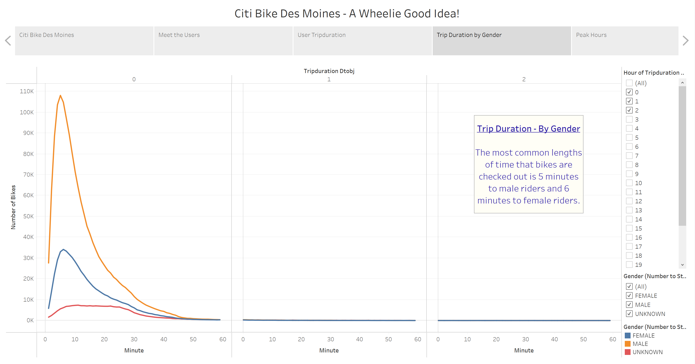

# Des Moines Bikesharing Proposal

## Table of Contents
* [Overview](https://github.com/rkaysen63/bikesharing/blob/master/README.md#overview)
* [Resources](https://github.com/rkaysen63/bikesharing/blob/master/README.md#resources)
* [Results](https://github.com/rkaysen63/bikesharing/blob/master/README.md#results)
* [Summary](https://github.com/rkaysen63/bikesharing/blob/master/README.md#summary)
* [Code](https://github.com/rkaysen63/bikesharing/blob/master/README.md#code)

## Overview:
    
NYC Citi Bike Manhattan records for the month of August were analyzed in order to determine the most likely usage and users if a similar bikesharing plan were initiated in the city of Des Moines, Iowa.  Bikeshare benefits include convenience, no maintenance to the user, ability to travel greater distances in a shorter time than walking, ability to make frequent and impromptu stops, and no time wasted looking for a parking space.  Des Moines has various attractions to tourists such as a riverwalk.  Local subscribers would enjoy the convenience of travel between points of interests, including work, the gym, restaurants, and home.

## Resources 
    
* Data: https://www.citibikenyc.com/system-data (201908-citibike-tripdata.csv.zip)
* Tools: 
  * Tableau
  * Jupyter Notebook
  * Python import Pandas
* Lesson Plan: UTA-VIRT-DATA-PT-02-2021-U-B-TTH, Module 14 Challenge
* Acknowledgements:
  * Des Moines Skyline Photo from:  https://en.wikipedia.org/wiki/Downtown_Des_Moines#/media/File:Skyline_downtown_Des_Moines.jpg
  * Attributed to By BarbaraLN - Flickr: Skyline, CC BY-SA 2.0, https://commons.wikimedia.org/w/index.php?curid=17089434

## Results:
    
[Link to Story: NYC Citi Bike Challenge](https://public.tableau.com/app/profile/roseanne.kaysen/viz/NYCCitiBikeChallenge_16228486503390/DesMoinesCitiBikeProposal)

  
  
  
  
  
  
  
  
  
  

## Summary:
    
Over 2.3 million records were analyzed.  The data shows that males are more than twice as likely to ride as females.  In Manhattan, the majority of the users are annual subscribers with non-subscribers, such as tourists, making up only 20% of the customers.  

The most popular days to ride are weekdays.  Any weekday has more riders than either weekend day.  Thursday is the most popular day to ride. The most popular weekday hours are 5 - 7 p.m. followed by 8 to 9 a.m.  Weekend riders tend to start their rides closer to the lunch hour and on into the afternoon.  There is more activity on Saturday than Sunday. Popular ride times and days are the same for both males and females.  On the basis of usage, the data suggests that many users ride to and from work.

The main costs associated with the proposal is the inital set-up and bike maintenance.  Initial set-up would include equipment purchases and app development.  Bike maintenance encompasses routine maintenance to keep the bikes in good working order, repair and possible replacement.  Routine maintence would require that some bikes to be temporarily rotated out of service.

The data suggests that residents, particularly males, would be the target audience for such a proposal since 80% of the Manhattan users are subscribers.  

It may be prudent to evaluate bikesharing data for several different locations throughout the US to see if the data is consistent or if it changes due to location.  Manhattan is an area where its residents are used to transportation modes other than a car, but what about the mid-West? 

## Code:
1. Create a DataFrame for the 201908-citibike-tripdata data.

        import pandas as pd

        # File to Load 
        citibike_data_to_load = "Resources/201908-citibike-tripdata.csv"
        citibike_df.head()

  

2. Check the datatypes of your columns. 

        citibike_df.dtypes

  

 

3. Convert the 'tripduration' column to datetime datatype.

        citibike_df['tripduration_dtobj'] = pd.to_datetime(citibike_df['tripduration'], unit='s')
        citibike_df.head()

  

4. Check the datatypes of your columns. 

        citibike_df.dtypes
        

  

    
        
5. Export the Dataframe as a new CSV file without the index.

        citibike_df.to_csv("Resources/201908_citibike_tripdata_revised.csv", index=False)      
        
6. Import the new CSV file into a dataframe to confirm the export included the new tripduration column of datetime objects

        citibike_df = pd.read_csv("Resources/201908_citibike_tripdata_revised.csv")
        citibike_df.head()
        
 

  

[Back to the Table of Contents](https://github.com/rkaysen63/bikesharing/blob/master/README.md#table-of-contents)
