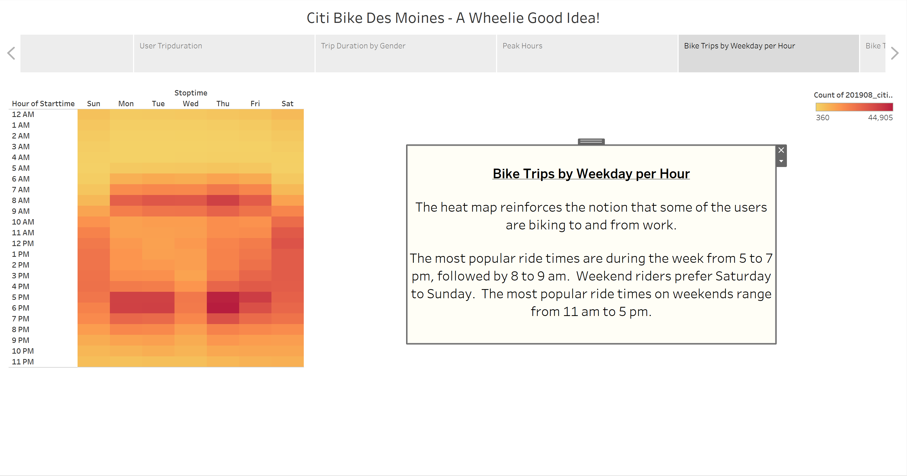
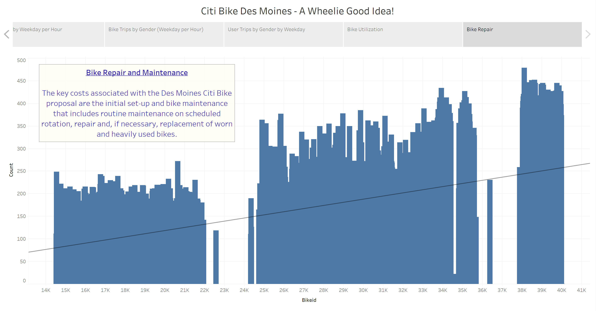

# Des Moines Bikesharing Proposal

## Table of Contents
* [Overview](https://github.com/rkaysen63/bikesharing/blob/master/README.md#overview)
* [Resources](https://github.com/rkaysen63/bikesharing/blob/master/README.md#resources)
* [Results](https://github.com/rkaysen63/bikesharing/blob/master/README.md#results)
* [Summary](https://github.com/rkaysen63/bikesharing/blob/master/README.md#summary)
* [Code](https://github.com/rkaysen63/bikesharingblob/master/README.md#code)

## Overview:
NYC Citi Bike Manhattan records for the month of August were analyzed in order to determine most likely usage and users if a similar bikesharing plan were initiated in the city of Des Moines Iowa.  Bikeshare benefits include convenience, no maintenance to the user, ability to travel greater distances in a shorter time than walking and without the hassle of driving and parking a car.  Des Moines has various attractions to tourists such as a riverwalk.  Local subscribers would enjoy the convenience of travel between work and restaurants or home.

## Resources 

* Data: https://www.citibikenyc.com/system-data
* Tools: 
  * Tableau
  * Jupyter Notebook
  * Python import Pandas
* Lesson Plan: UTA-VIRT-DATA-PT-02-2021-U-B-TTH, Module 14 Challenge
* Acknowledgements:
  * Des Moines Skyline Photo from:  https://en.wikipedia.org/wiki/Downtown_Des_Moines#/media/File:Skyline_downtown_Des_Moines.jpg
  * Attributed to By BarbaraLN - Flickr: Skyline, CC BY-SA 2.0, https://commons.wikimedia.org/w/index.php?curid=17089434

## Results:
[Link to Story](https://public.tableau.com/app/profile/roseanne.kaysen/viz/NYCCitiBikeChallenge_16228486503390/DesMoinesCitiBikeProposal)

  
  
  
  
  
  
  
  
  
  

## Summary:
The data shows that males are more than twice as likely as females to ride.  In Manhattan, the majority of the users are annual subscribers with tourists or other making up only 20% of the customers.  

The most popular days to ride are weekdays.  The most popular weekday hours are 5 - 7 p.m. followed by 8 to 9 a.m.  The users ride on weekends during the midday hours and generally more often on Saturday than Sunday.  Thursday has the most frequent trips.  The data indicates that perhaps in the Manhattan area, the users ride to and from work.

My recommendation would to perform this analysis on several cities of various sizes and in different regions to truly understand if these relationships are consistent or regional before making any conclusions about its applicability to Des Moines.

## Code:
1. Create a DataFrame for the 201908-citibike-tripdata data.

        import pandas as pd

        # File to Load 
        citibike_data_to_load = "Resources/201908-citibike-tripdata.csv"
        citibike_df.head()

  

2. Check the datatypes of your columns. 

        citibike_df.dtypes

***insert photo of dtypes here.

3. Convert the 'tripduration' column to datetime datatype.

        citibike_df['tripduration_dtobj'] = pd.to_datetime(citibike_df['tripduration'], unit='s')
        citibike_df.head()

***Insert photo of dataframe2 here

4. Check the datatypes of your columns. 

        citibike_df.dtypes
        
***insert photo of dtypes2 here.        
        
5. Export the Dataframe as a new CSV file without the index.

        citibike_df.to_csv("Resources/201908_citibike_tripdata_revised.csv", index=False)      
        
6. Import the new CSV file into a dataframe to confirm the export included the new tripduration column of datetime objects

        citibike_df = pd.read_csv("Resources/201908_citibike_tripdata_revised.csv")
        citibike_df.head()
        
 
***Insert photo of dataframe3 here
[Back to the Table of Contents](https://github.com/rkaysen63/bikesharing/blob/master/README.md#table-of-contents)
